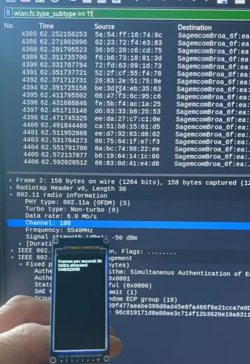
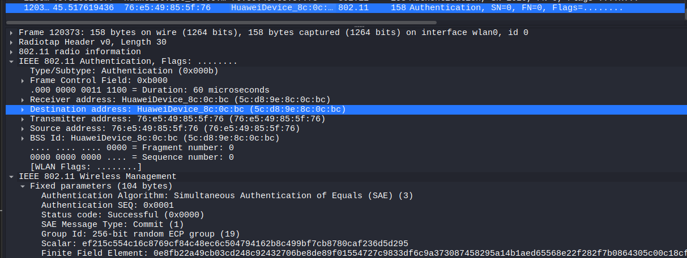
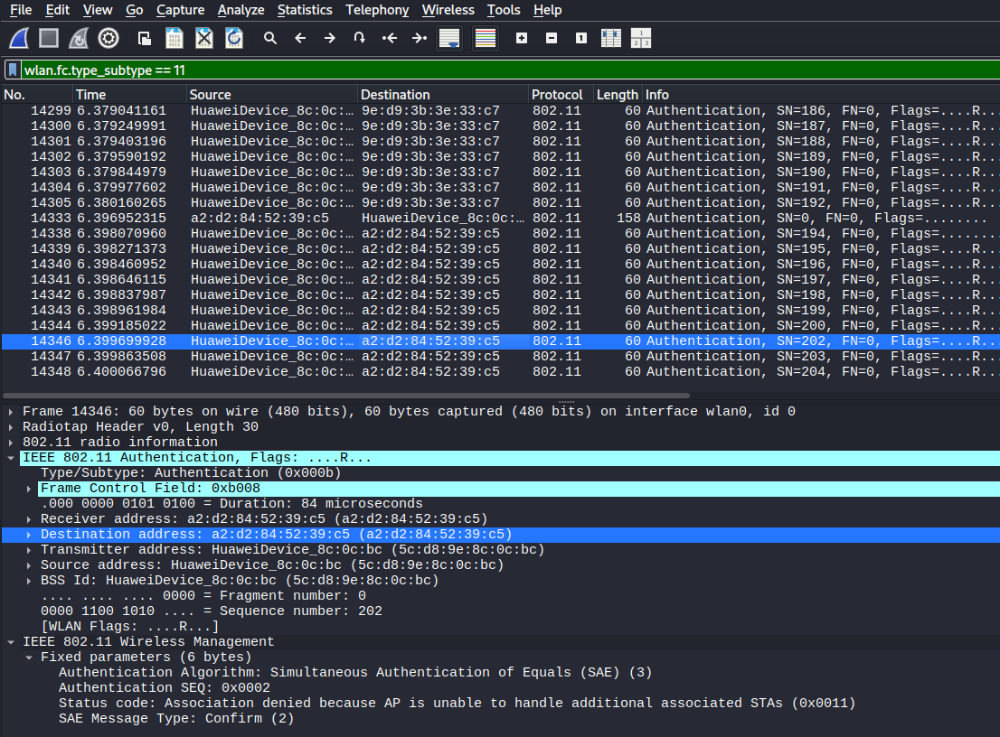

# Czech5
This project implements active broadcast deauth frames on selected targets on ESP32 C5. 
Based on https://github.com/risinek/esp32-wifi-penetration-tool

It also provides experimental attacks against the WPA3 routers based on SAE Commit frame. These are based on Mathy Vanhoef work: https://github.com/vanhoefm/dragondrain-and-time

Simple attack info is displayed on connected STA7789 1.9" TFT SPI display. Screen connection details:

Screen -> ESP32C5

GND -> GND

VCC -> 3V3

SCL -> 4

SDA -> 23

RES -> 14

DC -> 26

CS -> 25

BLK -> 13

# Deauth Features 
 - Up to 10 APs can be attacked with channel switching, just select them on the web page
 - Deauth frame has been fixed so now Active DOS attack works
 - On the other hand, passive and mixed attack mode and handshake and PMKID attacks have been disabled 

# WPA 3 Features

There are two types of WPA3 attacks. Both generate a random scalar and compute corresponding ECC point in a SAE Commit Frame. 

1) Dragon Drain aims to overload router with elliptic cryptography equations; it sends SAE Commit Frames on behalf of 20 MAC addresses with average of 50 FPS. Most of them should avoid anti-clogging token requests by the router. 
2) Client overflow which sends totally random MACs (using Random Generator). This causes router to respond with 'unable to handle additional associated STAs' and no new clients can connect. 

Important: only the second attack (Client overflow) is reliable. The dragon drain seems to slow down my router, sometimes disconnect a device but is never as powerful as original dragon drain which forges 200 frames per second. 

# WPA 3 details

Typical SAE Commit request:

STA Overflow response:
